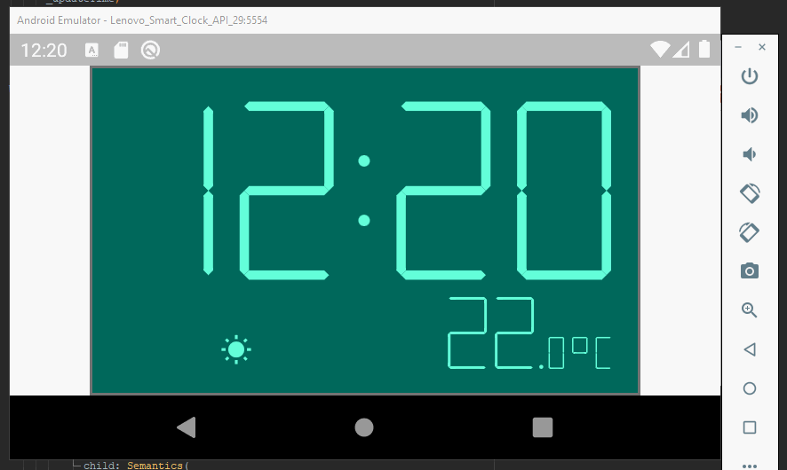

# Digital 7 Segment Clock

This clock was created for submission to the [flutter clock challenge](https://flutter.dev/clock).  
It ships with a light and a dark theme. The two clock faces were inspired by my microwave (light theme) and my former alarm clock (dark theme).  

Further features:
- 12/24 hour format option
- °C/°F temperature support (also negative temperatures)
- Weather indicators
- Blinking separator points

## About the themes

### Dark


My former alarm clock used to project the time in bright red light to the ceiling of my room,  
so i could know exactly for how many hours i already tried to fell asleep.  
This often leaded to even more panic about the missing sleep at the next day, which wasn't really helpfull when trying to rest ;-)

Contrast Ratio: [5.7:1](https://webaim.org/resources/contrastchecker/?fcolor=F44336&bcolor=000000)

### Light


My microwave has a backlight display where each icon can be distinguished even if "not turned on" because of the backlight.  
I wanted to create a clock face with this "retro technology" touch to give it a little ironic twist, because it will be displayed on a modern smart display, which has a much more advanced display technology.

Contrast Ratio: [5.3:1](https://webaim.org/resources/contrastchecker/?fcolor=64FFDA&bcolor=00695C)

## Demo



[Flutter web demo (https://flutter.nilsengelbach.com/)](https://flutter.nilsengelbach.com/)

## How to run

```
flutter channel stable
flutter upgrade
cd segment_clock
flutter create .
flutter run (on Android, iOS or web in landscape
```
